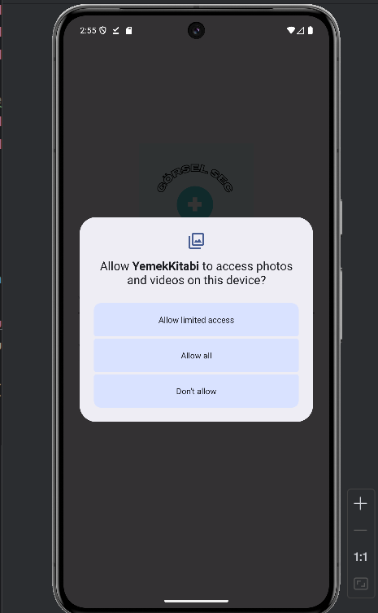
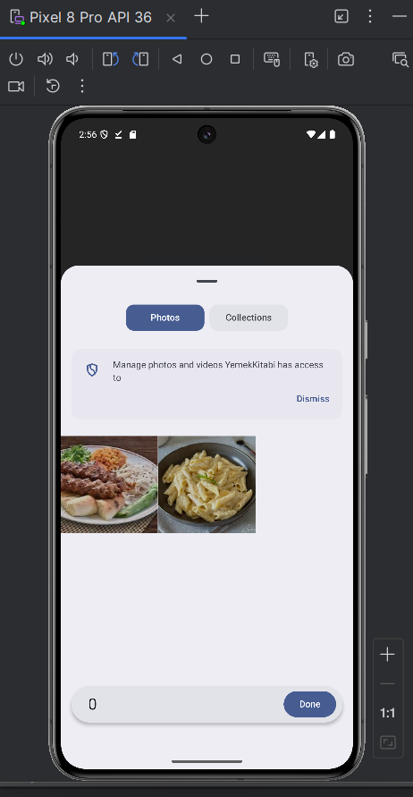
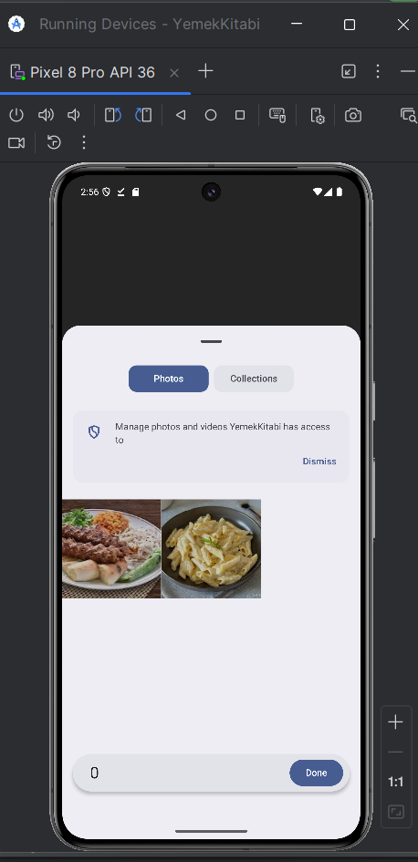

<h1>Permission Codes in Kotlin</h1>

<em>Kusursuz Kotlin Mükemmelliğiyle Yeniliği Güçlendirmek</em>

<em>Aşağıdaki araçlar ve teknolojilerle oluşturulmuştur:</em>

 

</ul>
</li>
</ul>

<h2>Permission Codes in Kotlin</h2>

If you want to get image file permission in Kotlin, you can find the latest codes suitable for every version.

<h2>Getting Started</h2>
<h3>Prerequisites</h3>

This project requires the following dependencies:

<ul class="list-disc pl-4 my-0">
<li class="my-0"><strong>Programming Language:</strong> Kotlin</li>
<li class="my-0"><strong>Package Manager:</strong> Gradle</li>
</ul>
<h3>Setup</h3>

Build Kotlin from source and install dependencies:

<ol>
<li class="my-0">

<strong>Clone the repository:</strong>

<pre><code class="language-sh">❯ git clone https://github.com/AliBasboga/get_Premission_In_Android_Studio
</code></pre>
</li>
<li class="my-0">

<strong>Go to the project directory:</strong>

<pre><code class="language-sh">❯ cd get_Premission_In_Android_Studio
</code></pre>
</li>
<li class="my-0">

<strong>Install dependencies:</strong>

</li>
</ol>

<strong><a href="https://kotlinlang.org/">Gradle</a> usage :</strong>

<pre><code class="language-sh">❯ gradle build
</code></pre>
<h3>Use</h3>

Run the project as follows:

<strong><a href="https://kotlinlang.org/">Gradle</a> usage :</strong>

<pre><code class="language-sh">gradle run
</code></pre>
<h3>Test</h3>

get_Premission_In_Android_Studio { <strong>test_framework</strong> } It uses the test framework. Run the test suite as follows:

<strong><a href="https://kotlinlang.org/">Gradle</a> usage :</strong>

<pre><code class="language-sh">gradle test
</code></pre>

 

